# Pgas.me

**Private gas for fresh EVM wallets, settled on Beam.**

On a public ledger a new wallet is tied forever to whatever funded it. There are two ordinary ways
to put gas into one: send from a wallet you already control, which links the two permanently, or
withdraw from an exchange, which ties the address to a KYC identity. Pgas.me is a third way: pay
once with a token you already hold, then have ETH show up in any set of fresh wallets, at the times
you choose, with no on-chain path back to what you paid with.

The value crosses into **Beam** — Mimblewimble: no per-address balances on chain, blinded amounts,
confidential assets — through the public Beam ⇄ Ethereum bridge, and comes back out through the
same bridge into the wallets you listed, each payout signed from a Beam address created for that
one order.

Status, 2026-09-10: the site, wallet sign-in, portfolio, quoting, deposits, the balance and the
scheduler run in production. Deposits are armed with a 0.002 ETH-equivalent floor. Payouts release
under wallet, coin and fee gates. The instant payout lane and the one-transaction Uniswap V4 hook
are both behind flags that are off — the hook deliberately, as a reviewed reference rather than a
deployment. Everything that moves money checks one kill-switch file before each irreversible step.

## How it works

Seven steps, in the screens themselves. Every picture below is this app, captured by its own
end-to-end suite against mock services — the balances, addresses and times in them are that
suite's example data, not anybody's account.

**1. Connect a wallet.** Any EVM wallet: a browser extension, a mobile wallet over WalletConnect,
or the browser inside your wallet app. You sign one message to prove the address is yours — a
signature, not a transaction, so it costs nothing and moves nothing. There is no email and no
password: the wallet is the account, and whoever controls it controls the balance.

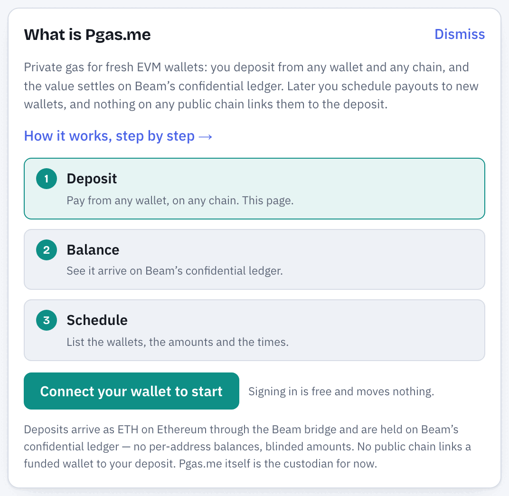

**2. Pick what you pay with.** Pgas.me reads what the wallet holds across every supported chain
and lists it, priced, so you tap a holding instead of hunting for a contract address. Choose what
you pay with and what the balance is kept in — ETH, DAI or WBTC on Ethereum. Type an amount and
the quote says what will land, how long it takes and what the bridge charges. Deposits carry no
Pgas.me fee; the minimum is 0.002 ETH-equivalent.

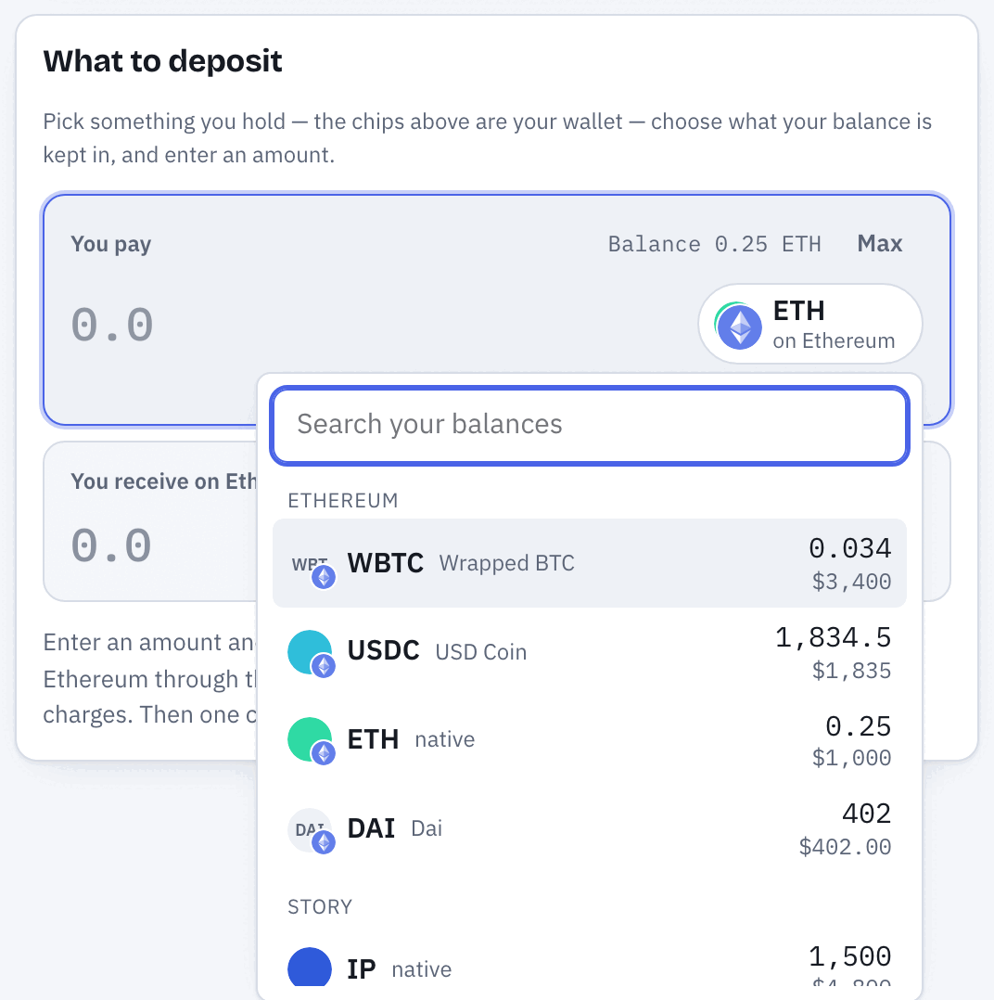

**3. Deposit — one transaction.** From another chain, one cross-chain order carries the value to
Ethereum and into the Beam bridge in the same fill: you sign once and never send a second
transaction. Already holding ETH, DAI or WBTC on Ethereum, it is a direct deposit into that
asset's pipe — also one transaction. The Uniswap V4 route, where it is switched on, is two steps in
your own wallet instead — a swap, then a deposit of exactly what arrived — plus the one-off
approvals a token needs the first time it is used.

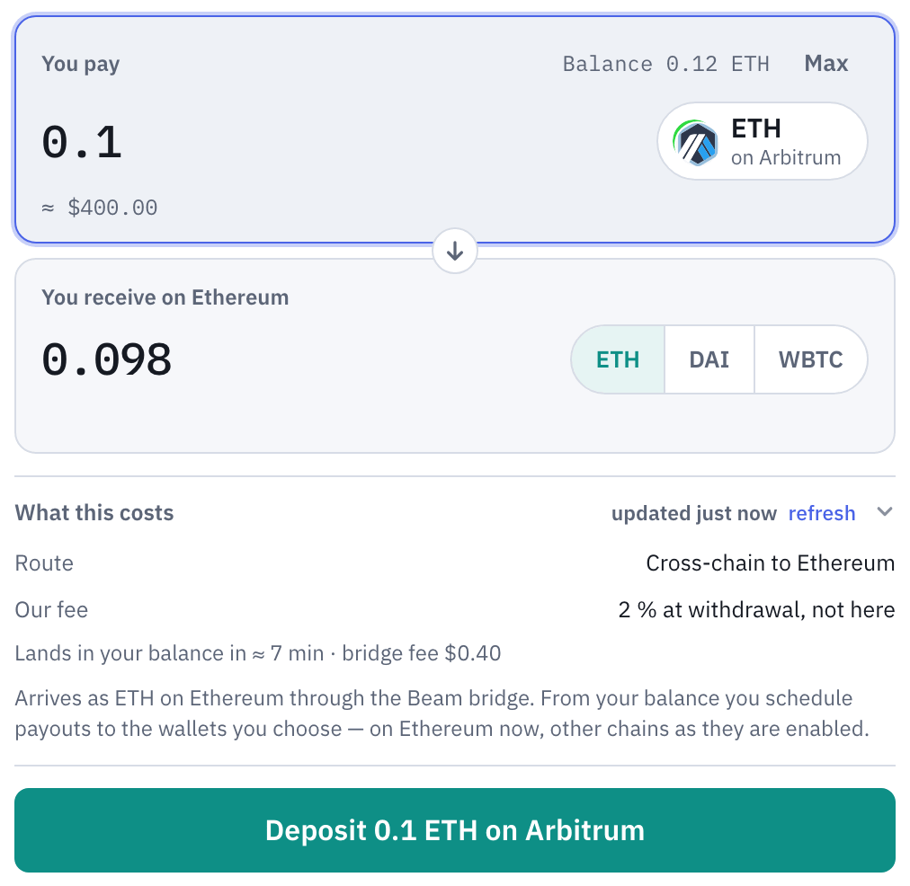

**4. Watch it cross.** The status card follows the deposit — submitted, order filled, bridging,
confirming (Ethereum's twelve), credited — and links your payment and the bridge transaction on
the explorers. About five minutes cross-chain, four to fourteen direct. A transaction no node can
see yet is not lost: the scanner attributes the lock to its quote by identity and credits it.

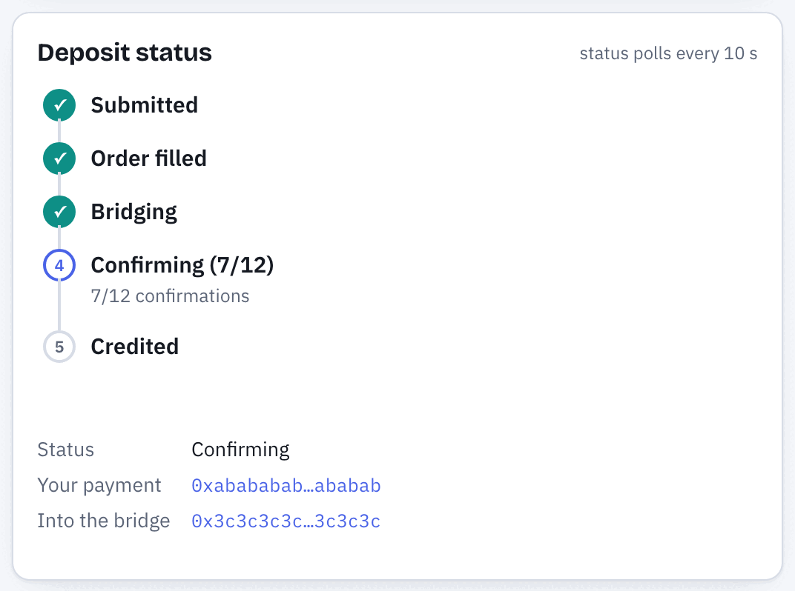

**5. Your balance on Beam.** Four numbers, always visible: **Arriving**, **Available**,
**Scheduled** (reserved for orders already placed, fees included) and **Paid out**. Each is a sum
over an append-only ledger rather than a stored figure, and the balance belongs to the wallet you
signed in with — the same from any device that connects it.

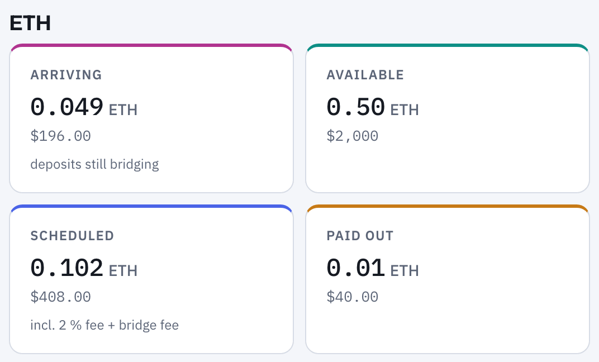

**6. Schedule the payouts.** List the wallets to fund — paste `address,amount` lines or add rows
by hand. Any amount, and a delivery time per row: ASAP, in two hours, tonight, tomorrow, or a date
and time you type. Every row prices itself from the server: what the wallet receives, our 2 % and
the bridge fee at cost, on top when the balance covers them and out of the amount when it does not
(the row says which). Nothing is signed here — a destination is just an address.

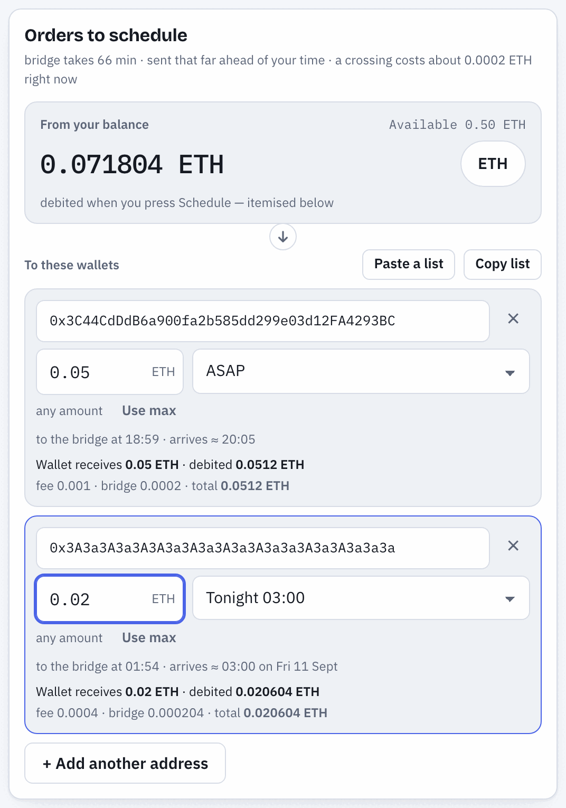

**7. Track it to the wallet.** Deposits and payouts share one timeline, newest first, each with its
status; tap a row and it opens — the wallet, the delivery time, when it goes to the bridge, the fee
and the links. An order is never marked failed for a problem on our side: it becomes **delayed**,
with the reason in plain words and the next attempt, and the money stays reserved. While it crosses
you can follow it on the bridge explorer; once it lands the row links the transaction that
delivered it. Cancel any order while it is still ours to stop and the amount and both fees go back
to Available.

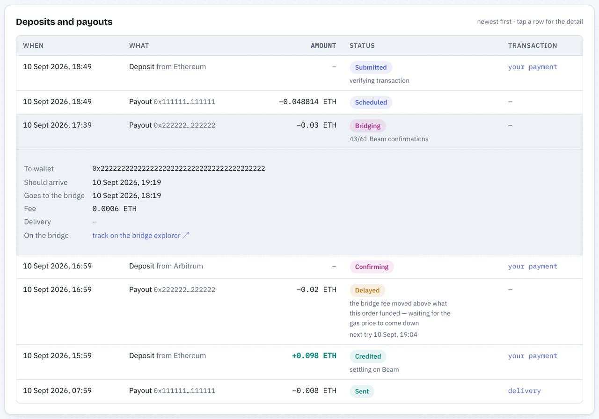

### Why it is private

The value crosses onto **Beam**, a confidential ledger: no per-address balances, blinded
amounts, no public account between your deposit and your payouts. Each deposit names **its
own receiver key** on Ethereum — index 0 is the old constant, byte for byte, so nothing in
flight is stranded — so no constant marks a deposit as ours; every payout is signed from a
**fresh Beam address created for that one order**, which has never received a deposit; and
the wallet you fund sees an ordinary inbound payment from the bridge contract rather than
a transfer from an address you already own or an exchange withdrawal. Choosing a delivery
window instead of ASAP, and splitting an amount across rows, is what breaks the timing
match.

What it does **not** do, said plainly. The public chain can tell that the wallet was
bridge-funded — what it cannot tell is which deposit paid for it. Pgas.me sees both ends:
this version is custodial, the pairing is nulled once an order settles and no IP logs are
kept beyond what rate limiting needs, and that is a procedure rather than a proof. The
bridge relayer is one party acting on both chains and can read the wallet's coin graph, so
it can tie a crossing back to the claim that funded it — and the per-deposit keys are all
still ours, so on a bridge this quiet a key that never repeats removes a marker rather
than creating a crowd. Deposits are **not shielded today** — the pool holds roughly 28,000
outputs and grows about 30 a day against the 65,536 a full-size proof wants, and a
shielded output's other exit is a 72-hour timer, so the code is written and the switch is
off. Instant payouts, where that lane is enabled, all arrive from one Pgas.me address and
are linkable to each other. And amounts and timing remain the link no ledger can hide for
you.

The per-observer, per-stage version of that is [Who sees what](#who-sees-what) below.

## How a deposit gets in

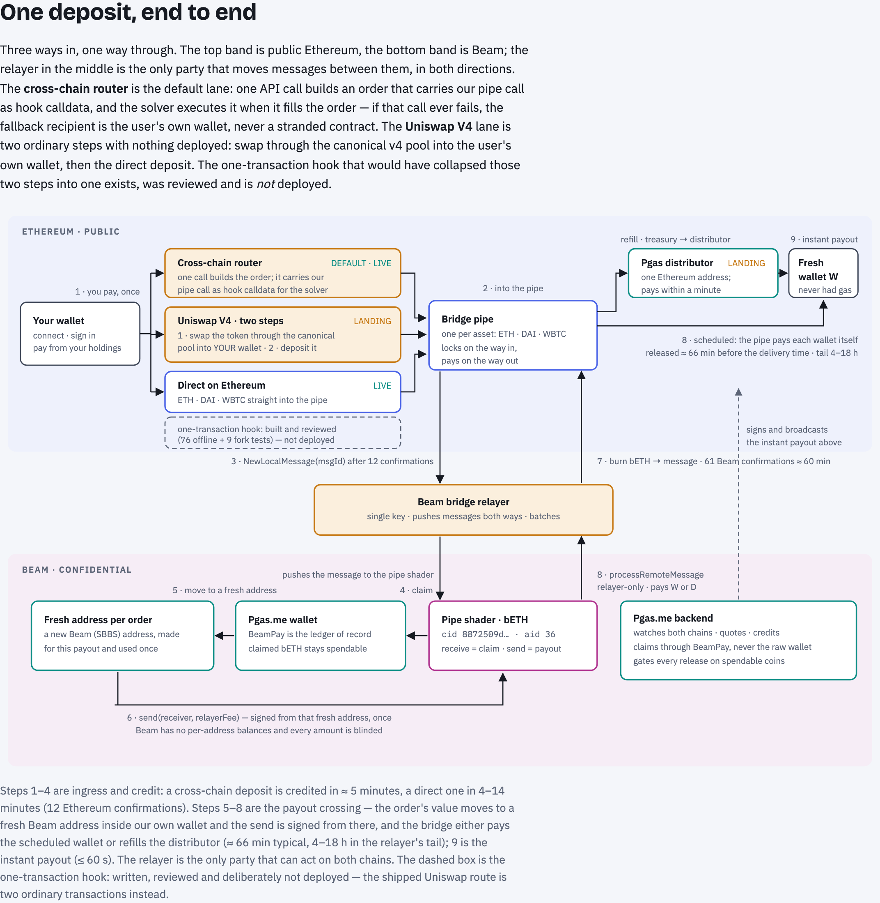

Three ways in, one way through. Whichever route you take, the money ends up in the **bridge pipe**
of the asset you chose — one contract per asset, `EthPipe` for ETH and an ERC-20 pipe each for DAI
and WBTC — and the bridge relayer mints the confidential twin on Beam.

1. **Cross-chain route (the default).** Pay from any supported chain. One API call builds an order
   that carries our pipe call as hook calldata; the solver that fills the order executes that call
   as part of the fill, so the asset never rests anywhere in between. If the hook call would revert,
   the order API says so instead of handing us a transaction that fails; if it reverts on chain
   anyway, the fill lands at a fallback recipient, which we set to the user's own wallet. Credited
   in about five minutes.
2. **Uniswap V4, two steps.** From Ethereum, for a token with a canonical v4 pool against ETH: swap
   through the Universal Router into **your own wallet**, then make the ordinary deposit with what
   actually arrived. Priced by reading the V4 Quoter on the canonical pool, never by our own curve
   math. Nothing of ours is deployed on this path — the two transactions are both yours, and an
   approval is replaced by a Permit2 signature where the wallet can sign typed data.
3. **Direct on Ethereum.** You already hold ETH, DAI or WBTC: one transaction straight into that
   asset's pipe.

After the lock, the sequence is the same for all three: 12 Ethereum confirmations, the relayer
pushes the message to Beam, we claim it, and the balance is credited — 4–14 minutes for a direct
deposit. A lock nobody registered is still credited: the scanner attributes it to the quote whose
sender and calldata match it, so a slow node does not lose a deposit.

## What the user does

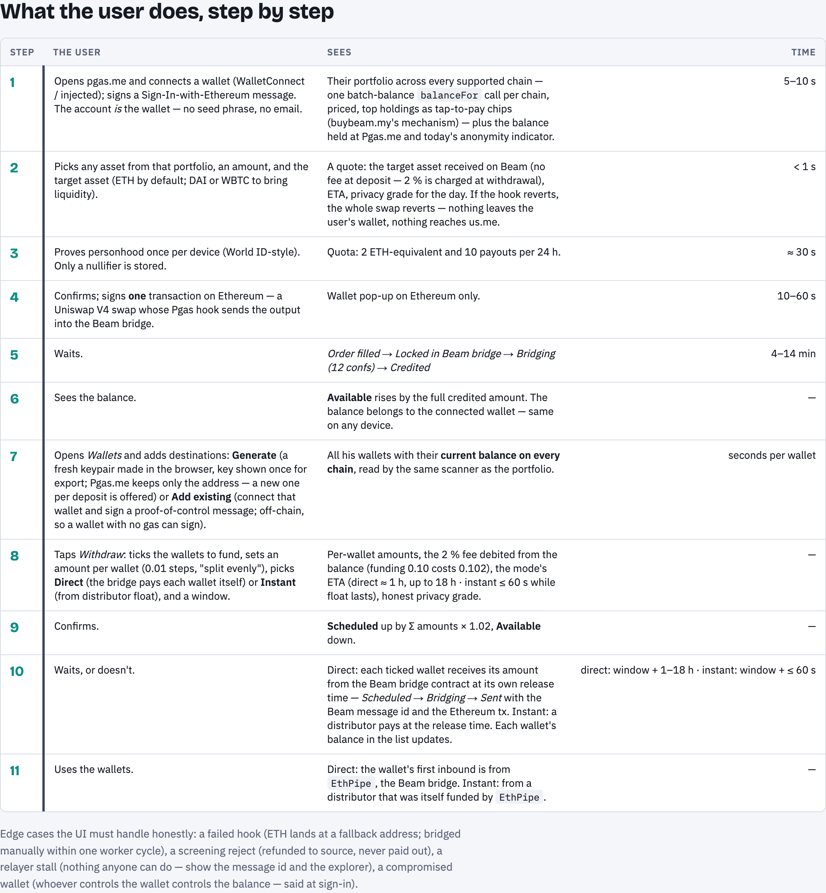

Destinations are just addresses. There is **no wallet generation** and **no signature to prove a
destination** — you paste an address, and the checks are its EIP-55 checksum and whether it holds
contract code. Every wallet you list becomes its own order.

## What the platform does

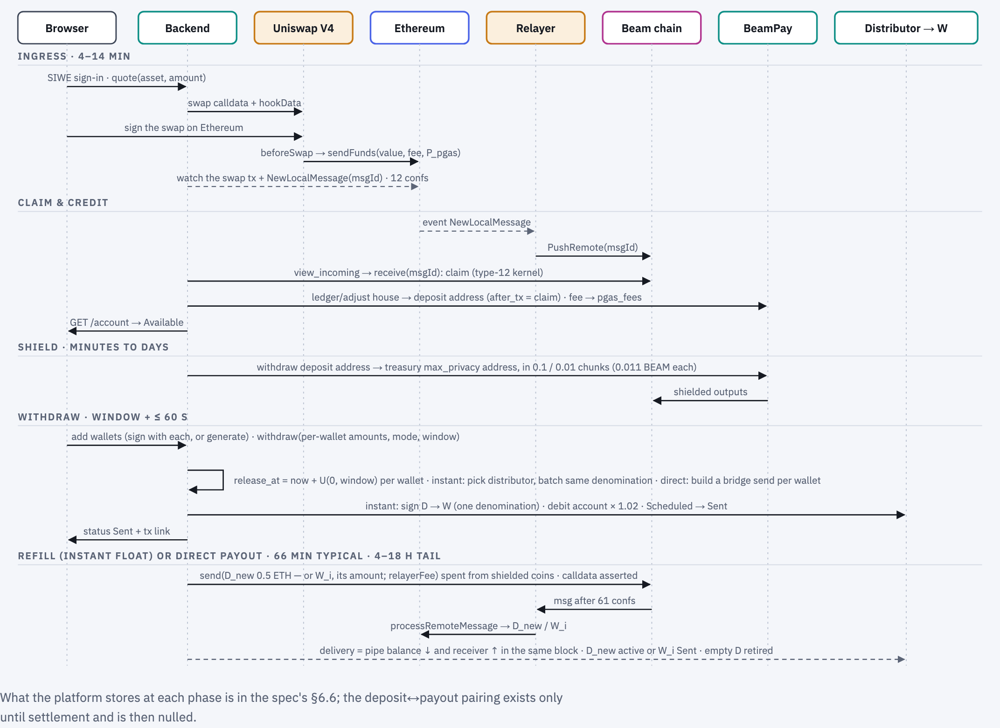

Deposits are watched on chain, not trusted from the client. A transaction hash is recorded before
it is registered, so a sent transaction is never stranded when no node can see it yet. Balances are
**sums over an append-only ledger**, never stored numbers. Every step emits an event, and an
independent watchdog runs outside the API process, so a stuck worker is noticed by something that
is not the stuck worker.

## The treasury stays spendable

What we claim is what we distribute: the bETH is booked to our own Beam address and stays
spendable, with no shielding step in between. The reason is measured rather than assumed — a
max-privacy output on Beam unlocks either when its anonymity set is reached or when the wallet's
72-hour timer expires, and with the shielded pool at roughly 28,000 outputs growing about 30 a day,
the 65,536 a maximum-size proof needs is about three years out, so the timer is the only exit that
ever fires and a payout released against outputs still under it does not warn, it fails.

The privacy work moves to the payout side instead. For each order the value is moved to a **fresh
single-use Beam address inside our own wallet** and the bridge send is signed from there, so the
signing address never received a deposit. The shielding code and its working-float policy still
exist behind a flag that is off; if Beam's pool ever grows into a set worth using, it switches back
on above this same treasury and nothing in the payout path changes.

## One receiver key per deposit

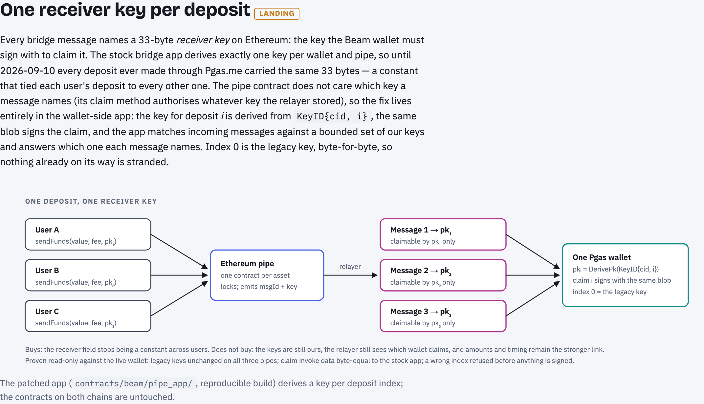

Every bridge message names a 33-byte **receiver key** on Ethereum — the key the Beam wallet must
sign with to claim it. The stock bridge app derives exactly one key per wallet and pipe, so the same
33 bytes appeared in every deposit anyone ever made through us: a constant that tied one user's
deposits to another's. The pipe contract does not care which key a message names, so the fix lives
entirely in the wallet-side app: the key for deposit *i* comes from `KeyID{cid, i}`, the same blob
signs the claim, and the app answers which key each incoming message names. Index 0 is the legacy
key byte-for-byte, so nothing already in flight is stranded.

The patched app, its reproducible build and the read-only proofs against a live wallet are in
[contracts/beam/pipe_app/README.md](contracts/beam/pipe_app/README.md). Both chains' contracts are
untouched.

## Balance, statuses and fees

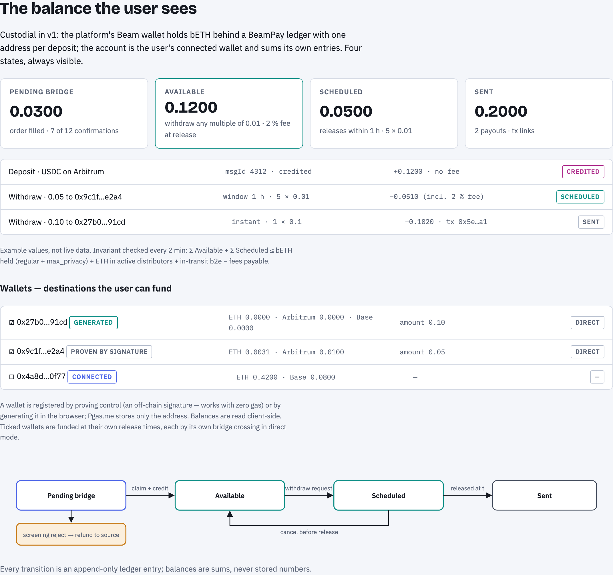

Four states, always visible: **Arriving · Available · Scheduled · Paid out**. Custodial in this
version — the platform's Beam wallet holds the asset behind a BeamPay ledger, and the account that
sums its own entries is the wallet you signed in with, so the same balance appears on any device you
connect that wallet from.

Payout statuses are `scheduled → releasing → bridging → delivering → sent`, plus `cancelled` and
`delayed`. **There is no "failed" for an internal cause.** A refused Beam send, a relayer-fee spike,
no free coin, an unreadable wallet: each of those makes the order `delayed`, with the reason in
plain words, the time of the next attempt and a fresh arrival estimate, and the money stays
reserved while the processor retries. An order ends because you cancelled it, not because something
of ours went wrong.

**Fees are 2 % (ours) plus the bridge fee at cost (passed through), itemised as two lines.** When
your balance covers them they are added **on top**, and the wallet receives exactly the amount you
typed. When it does not, they come **out of the amount**, the row says so, and the wallet receives a
little less — a batch is refused only if the balance is short of the amount itself. There is no
economic minimum on a payout: the only floor is technical, one unit of the asset's 8-decimal grid.
The bridge fee is quoted live at the moment you ask for it, with headroom that rises the further
ahead you schedule; unspent headroom stays with the treasury.

Deposits carry no fee at all. The deposit floor is 0.002 ETH-equivalent.

## Payouts

Two lanes, per row.

- **Scheduled (live).** You give a delivery time; the order is released to the bridge about 66
  minutes before it, and the pipe contract pays the wallet itself. The wallet's first inbound is
  from the bridge contract — not from you, not from an exchange. Typically ~66 minutes, with a tail
  of 4–18 hours in the relayer's queue.
- **Instant (flag-gated).** A Pgas distributor address pays the wallet directly in under a minute,
  and the treasury refills that address over the bridge in the background. The trade is stated
  where the mode is chosen: instant payouts arrive from one known sender, so they are linkable to
  each other.

Anything with a Beam-side kernel can be followed on the bridge explorer. The explorer keys on the
**block height**, not the transaction id:

```
https://beamterminal.0xmx.net/#/explorer/bridge?tx={block_height}
```

## Who sees what

Pgas.me does not claim privacy it cannot deliver. This is what each observer can link, stage by
stage — including Pgas.me itself, which in this version is custodial and knows the pairing until
settlement, then nulls it:

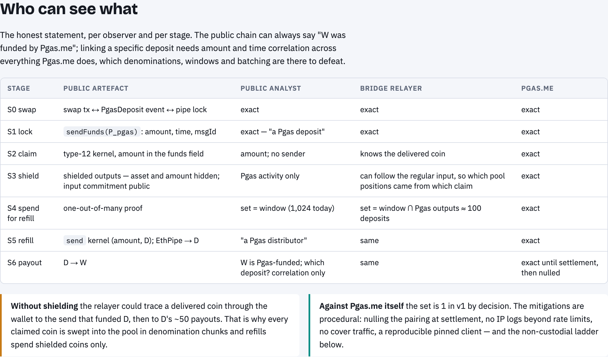

The bridge is operated by a single relayer key, Beam's shielded pool is small today, and the
largest anonymity sets on Ethereum belong to other tools. Saying that plainly is part of the
product.

## Trust ladder

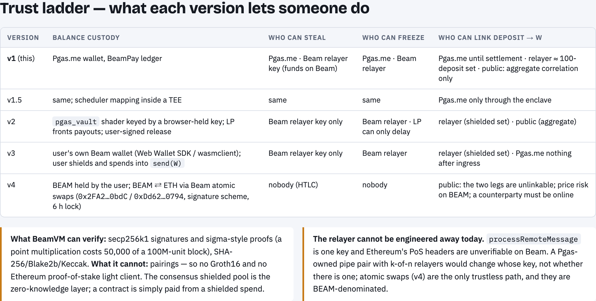

Each version hands a little more custody back to the user, until the last one needs no operator at
all.

## Stack

- **web/** — React 18 + Vite + TypeScript + ethers v6. Injected wallets (EIP-6963 and legacy
  `window.ethereum`), WalletConnect v2, Sign-In with Ethereum, cross-chain portfolio through
  batch-balance contracts, deposit / balance / schedule / activity screens. Playwright end-to-end
  tests against a mock wallet and a mock API.
- **api/** — FastAPI + MongoDB (Python 3.12). SIWE sessions, quotes for all three routes, the
  on-chain deposit scanner, an append-only per-asset ledger, the claim worker, the scheduler and
  the payout workers, stats, alerting (default-deny) and the stuck-service watchdog. The test suite
  is offline: no network, no RPC, no live database.
- **Beam side** — a Beam node plus `wallet-api`, with **BeamPay** as the only interface to the
  wallet's money, the public Beam ⇄ Ethereum bridge pipes (`EthPipe`
  `0xB1d7FF9D3aCaf30e282c5F6eb1F2A6503f516a96` for ETH, ERC-20 pipes for DAI and WBTC), and the
  patched wallet-side bridge app in `contracts/beam/pipe_app/`.
- **contracts/** — the Solidity ingress (Foundry): a zero-liquidity **gateway pool** and a hook
  whose `beforeSwap` takes the whole input, routes it through the canonical Uniswap V4 pool that
  Uniswap's own LPs fund, and forwards the entire output into the bridge pipe in the same
  transaction. It is built, reviewed twice and **not deployed** — see the section below and
  [FEEDBACK.md](FEEDBACK.md) for why. Details, risks and the grid arithmetic that keeps a bridged
  amount mintable: [contracts/README.md](contracts/README.md).

**Deployed addresses: none.** We have deployed no contract of our own. The addresses the code pins
are third-party infrastructure only — the Uniswap V4 `PoolManager` and Quoter, the Universal
Router, Permit2, the canonical CREATE2 proxy and the public Beam bridge pipes — all in
`contracts/script/PgasAddresses.sol` and the API's config.

## Uniswap V4 integration — where to look

Two Uniswap V4 paths live in this repository, and only one of them ships.

What **ships** is the two-step route: swap the token you hold through the canonical Uniswap V4 pool
with the Universal Router — priced by reading the V4 Quoter — into your own wallet, then deposit
what arrived. Both halves are here and both are tested: the API builds the `execute` calldata and
the approvals, the client sends them in order and re-quotes on what actually landed. The route is
dark on our own deployment until its pool registry (`PGAS_UNISWAP_POOLS`) is filled, and that is
the only thing between this code and a live swap — nothing else is missing.

Beside it, built and adversarially reviewed but **not deployed**, is the one-transaction hook
route: a zero-liquidity gateway pool whose `beforeSwap` routes the input through the canonical pool
and forwards the whole output into the pipe in the same transaction.

Why we built the hook and then shipped two clicks instead, with the numbers:
[FEEDBACK.md](FEEDBACK.md).

Every line range below was re-checked against the files in this commit.

### Shipping: the two-step route (Universal Router + V4 Quoter)

| what | file | lines |
|---|---|---|
| The pins: `execute` selector, the `V4_SWAP` command byte, the action ids | `api/pgasme/uniswap.py` | L112–L120 |
| Which pairs have a route, and the canonical hook-less pool each one prices against | `api/pgasme/uniswap.py` | L368–L416 |
| The V4 Quoter read — `quoteExactInputSingle` by `eth_call`, never our own curve math; an unreadable quote is never a zero | `api/pgasme/uniswap.py` | L540–L628 |
| Pool liveness before we quote — `extsload` of slot0 and liquidity on the PoolManager, so a dead pool is refused as a dead pool | `api/pgasme/uniswap.py` | L630–L690 |
| The action encoding: `SWAP_EXACT_IN_SINGLE`, `SETTLE_ALL`, `TAKE_ALL` | `api/pgasme/uniswap.py` | L691–L723 |
| **`UniversalRouter.execute(bytes commands, bytes[] inputs, uint256 deadline)` — the whole of step 1** | `api/pgasme/uniswap.py` | L724–L736 |
| The approvals, in order: the zero-first reset a USDT-style token needs, the token's allowance to Permit2, then Permit2's allowance for the router with its expiry | `api/pgasme/uniswap.py` | L909–L977 |
| The two-step branch of `POST /v1/quote` | `api/pgasme/routers/quote.py` | L968–L1127 |
| Which route a request gets — one resolver, `uniswap.wants_uniswap`, and what happens when the registry is unreadable | `api/pgasme/routers/quote.py` | L929–L967, L1354 |
| Which `uniswap` shape a quote is — the API says so, the client never guesses | `web/src/pages/Deposit.tsx` | L330–L344 |
| Send every approval in order, then the swap, then re-quote what actually arrived | `web/src/pages/Deposit.tsx` | L806–L860 |
| When the Uniswap route is offered at all, and when it is not | `web/src/pages/Deposit.tsx` | L285–L311, L350 |
| Which ingress routes are open — the API's statement, read in one place | `web/src/lib/ingress.ts` | L19–L47 |
| The golden vector: the exact calldata at block 25,942,000, written by the API's test and executed by the fork test | `contracts/test/vectors/uniswap-two-step.json` | whole file |
| The API's own calldata sent to the **real** Universal Router on a mainnet fork — 9 tests, including proof that command `0x10` is `V4_SWAP` in the deployed router and that the pool id and state slot we compute are the live ones | `contracts/test/fork/UniswapTwoStep.t.sol` | whole file |
| The builder under test (33) and the flow driven against a mock wallet (10) | `api/tests/test_uniswap_two_step.py`, `web/e2e/uniswap-two-step.spec.ts` | whole files |

### Reference, not deployed: the one-transaction hook route

| what | file | lines |
|---|---|---|
| Hook permissions → the `0x2888` address mask the hook must be mined to | `contracts/src/PgasIngressHook.sol` | L256–L284 |
| `beforeSwap`: take the whole input, swap the canonical pool, split on the bridge grid, pipe it | `contracts/src/PgasIngressHook.sol` | L505–L588 |
| The inner swap on the canonical pool (`InnerSwapEmpty`, not a silent zero) | `contracts/src/PgasIngressHook.sol` | L594–L610 |
| `_sendToPipe`, and the post-condition that exactly the output left this contract | `contracts/src/PgasIngressHook.sol` | L612–L645 |
| `registerRoute` — write-once per pool, with the grid derived from the output asset | `contracts/src/PgasIngressHook.sol` | L290–L365 |
| The two public probes an operator can read before arming: `requiredGrid`, `pipeRejectsUnknownCalls` | `contracts/src/PgasIngressHook.sol` | L439–L475 |
| The bridge grid split: `value` floored to 8 decimals, the unmintable tail riding on the relayer fee | `contracts/src/libraries/PipeSplit.sol` | L33–L47 |
| The router: `deposit` → `unlock` → `unlockCallback` → `settle`, and the surplus refund | `contracts/src/PgasRouter.sol` | L84–L147 |
| `msgSender()` in transient storage, so the hook can attribute the deposit to the real payer | `contracts/src/PgasRouter.sol` | L149–L167 |
| Every pinned address, pipe code hash and event topic, in one place | `contracts/script/PgasAddresses.sol` | L10–L58 |
| Proof that a hook may swap a *different* pool from inside `beforeSwap`, all four deltas netting to zero | `contracts/test/fork/PgasMainnetFork.t.sol` | L153–L200 |
| A 50-USDC deposit into the **real** Beam bridge pipe on a mainnet fork, event and balance asserted | `contracts/test/fork/PgasMainnetFork.t.sol` | L217–L263 |
| The pinned pipe code hashes, read at the pinned block and again at the chain tip | `contracts/test/fork/PgasMainnetFork.t.sol` | L414–L474 |
| Golden vectors both the Solidity and the Python split are tested against | `contracts/test/vectors/grid.json`, `contracts/test/vectors/events.json` | whole files |
| Decoding the hook's `PgasDeposit` log (`deposit_log`) | `api/pgasme/uniswap.py` | whole file, hook section |
| The value band a lock may fall in, and the refusal when a quote's own numbers admit none | `api/pgasme/uniswap.py` | whole file, hook section |
| Crediting a bridge lock back to the deposit its `PgasDeposit` log names | `api/pgasme/scanner.py` | L446–L504 |

The offline suite is 76 tests and the mainnet-fork suite is 9; both are described in
[contracts/README.md](contracts/README.md).

## Running it

```bash
# API (Python 3.12+, MongoDB on localhost)
cd api && python3 -m venv .venv && .venv/bin/pip install -e '.[test]'
cp .env.example .env            # fill in what you need; nothing is armed by default
.venv/bin/pytest -q
.venv/bin/uvicorn pgasme.main:app --port 8300

# Web
cd web && npm ci && npm run dev  # proxies /api → http://127.0.0.1:8300
npx playwright test              # end-to-end against a mock wallet

# Contracts (Foundry, plus Node for the pinned Uniswap sources)
cd contracts && npm install      # @uniswap/v4-core and v4-periphery, pinned exactly
forge build
forge test -vv                   # the offline suite: no network, no RPC, no fork

# The mainnet-fork suite needs an archive RPC and is excluded from a bare `forge test`
export FORK_RPC_URL=https://eth.drpc.org
FOUNDRY_PROFILE=fork forge test -vv
```

Read the exit code, not the last line: `forge test | tail; EXIT=${PIPESTATUS[0]}`.

## License

MIT — see [LICENSE](LICENSE).
